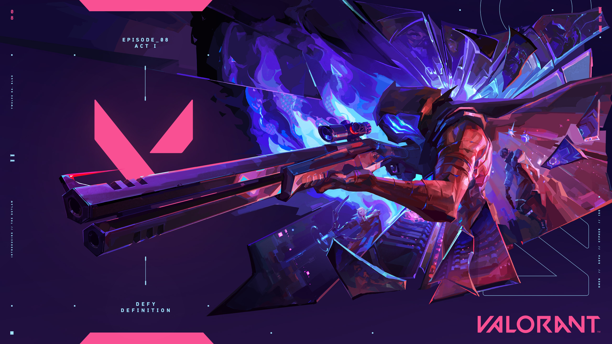
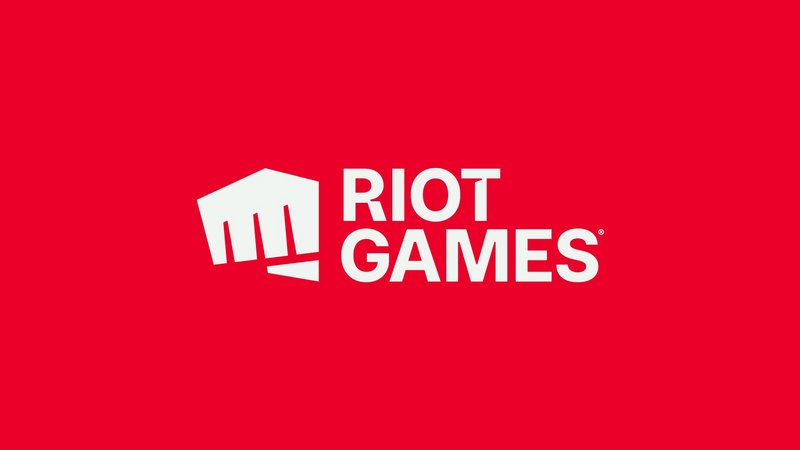
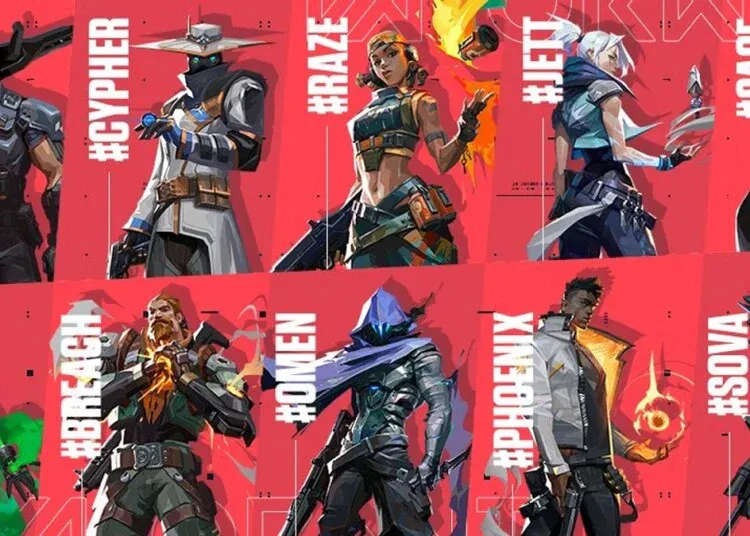
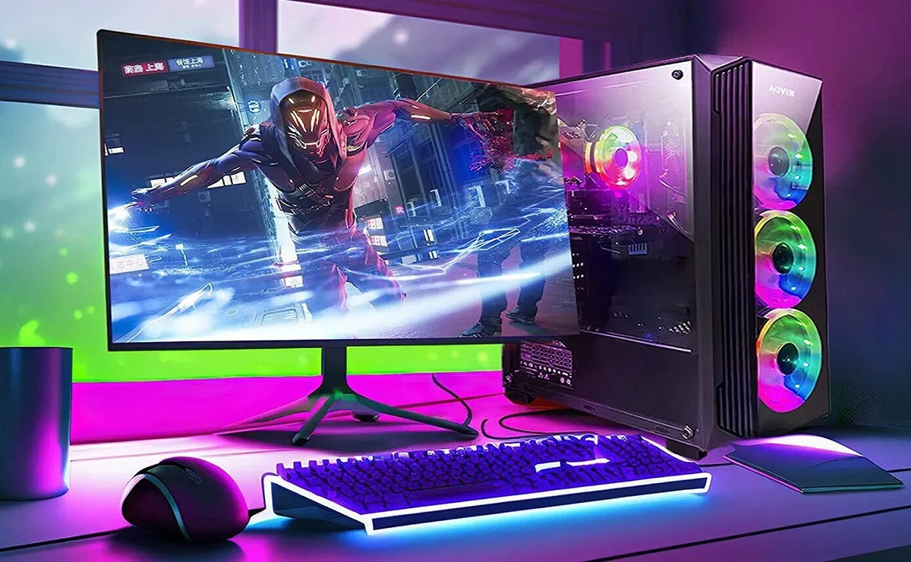
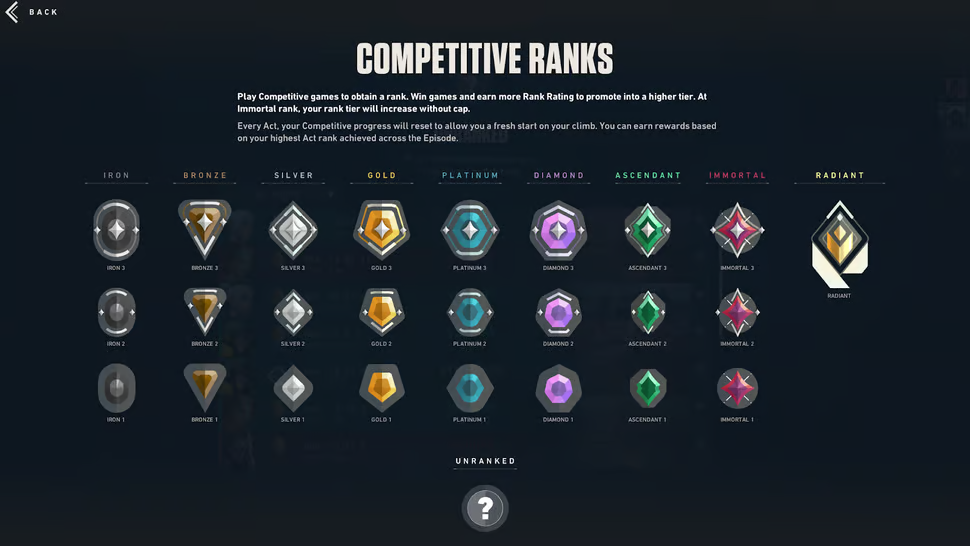
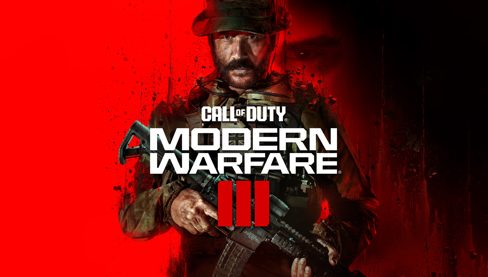
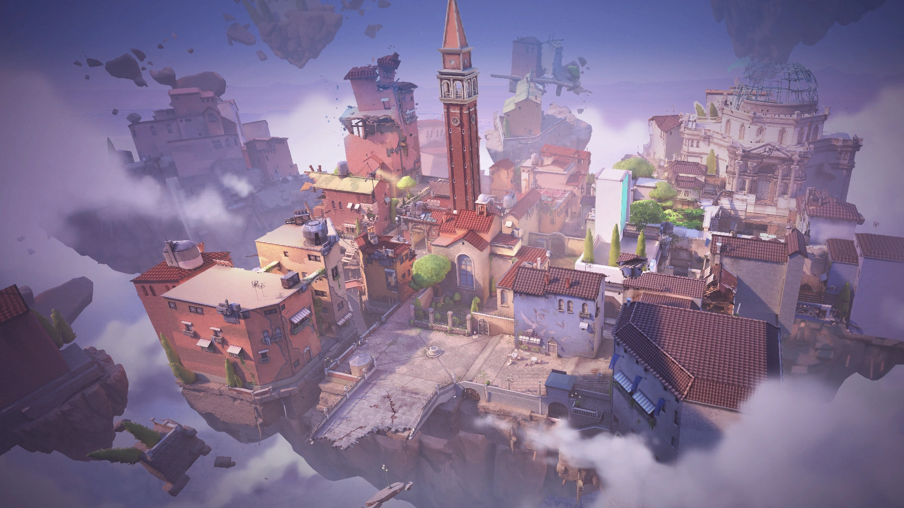

---

marp: true
theme: iggg
class: lead

---

 
 
---

---

# The company who makes Valorant is Riot Games

---

# Why I like Valorant?
 ## I like it for its tactial gameplay, unique characters, competitiveness, regular events, and strong community among e sports. 

---

 # Valorant is a free to play game that is available to anybody that has a gaming computer or laptop.

---

## You can either get Valorant from a game store and play it on a XBox or you can download it online for free onto your computer and play for free on there. 

 ---

 # Valorants main ofice is located in Los Angelos 

 ---

## Competitors of valorant include Call of duty as it is known for its fast-paced action and battle royales. Another compeitior would be League of Legends is known for its strategic ganeplay, and team-based battles. 

---

 -  ## One of the most innnovate anti-cheating systems 
  
- ## The amount of lore behind every agent
  
- ## Detaiailed maps

--- 

# Thank you for listening!
